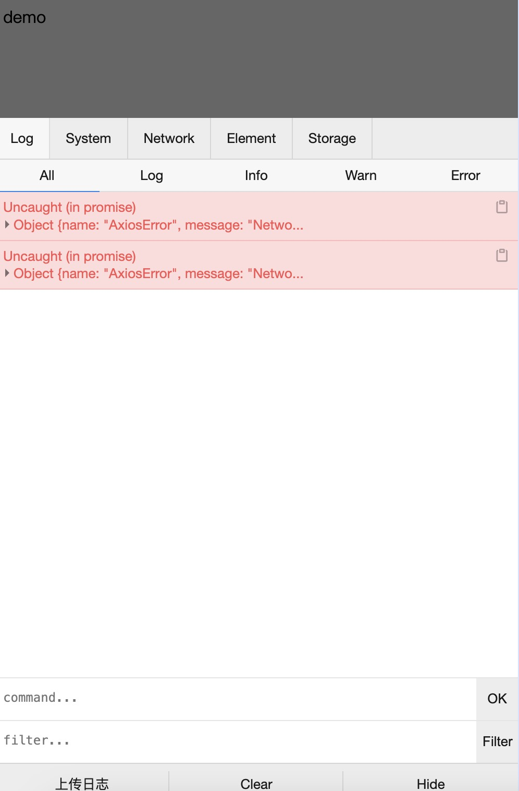
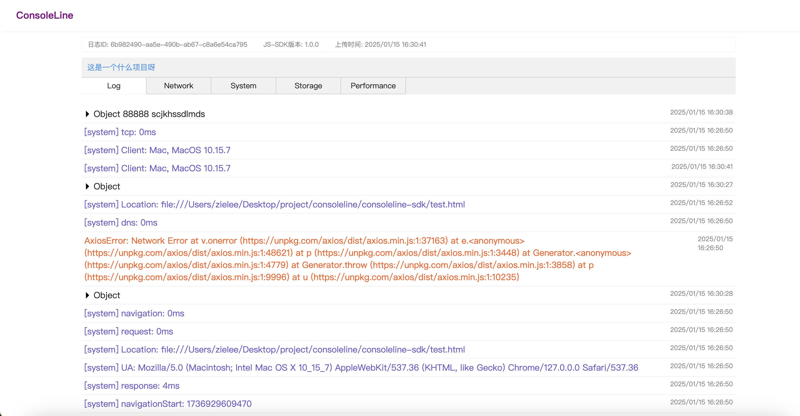
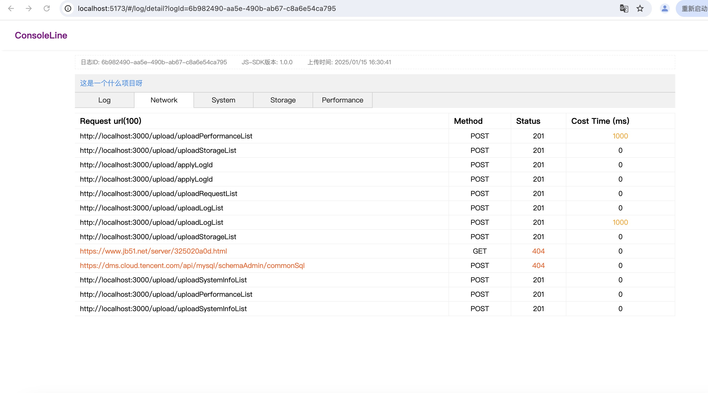

## consoleLine 日志收集与在线预览

### 技术栈
React、Nodejs、Nestjs、mysql

### 目的
基于vconsole二次开发，通过sdk收集前端调试console日志、接口请求信息、 客户端缓存信息、 性能信息，实现在线预览用户行为记录

### 示例
#### 1、sdk效果(assets/sdk.png)

#### 1、log记录效果(assets/log.png)

#### 1、接口请求效果(assets/request.png)


### 设计
1、服务端【consoleline-server】需要用户部署在服务器，并提供数据库,在table-sql目录下存表结构，请记住需要添加log_id 索引）<br/>
2、在线预览web【consoleline-web】（需要用户部署在服务器）<br/>
3、打包到项目中的SDK【consoleline-sdk】(可push到npm或者build到自己项目) <br/>

### sdk使用
#### 1、html脚本引入
```js
<script src="./dist/consoleline.js"></script>

<script>
console.log(new Conoleline({
    themeColor: '#800080',
    uploadBaseUrl: 'http://localhost:3000',
    previewBaseUrl: 'http://localhost:4000',
    description: '这是一个什么项目呀'
}))
</script>>
```

#### 2、项目引入
```js
import Conoleline from 'consoleline' 

<script>
console.log(new Conoleline({
    themeColor: '#800080',
    uploadBaseUrl: 'http://localhost:3000',
    previewBaseUrl: 'http://localhost:4000/#/log/detail',
    description: '这是一个什么项目呀'
}))
</script>>
```

### sdk参数解析
| name | type | require | desc |
| -- | ---- | --- | ------ |
| themeColor | string | false | 浮层图标颜色 |
|  uploadBaseUrl | string | true | 服务端部署后的接口域名地址 |
| previewBaseUrl | string | true | 客户端部署后的访问地址 |
| description | string（100） | false | 自定义项目描述、版本、环境等信息 |
